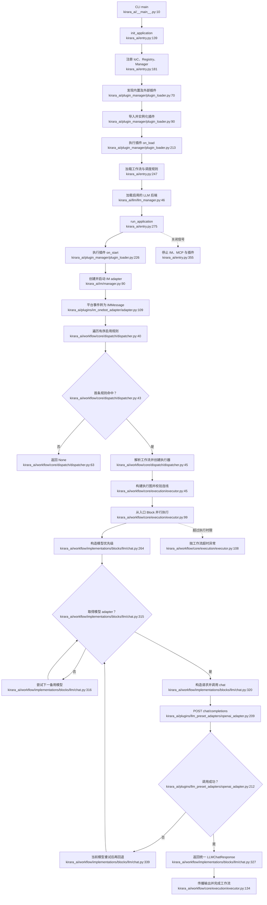

# F1. Kirara 平台主链路

## 范围

本流程覆盖当前工作树中的应用启动、插件生命周期、IM 消息标准化、调度规则匹配、工作流执行和 LLM 选择。OneBot 协议细节另见 F2-F5。

## Happy path

1. CLI 初始化配置和 IoC 容器，加载插件、工作流、调度规则及 LLM 后端。
2. 运行阶段启动插件和已启用的 IM adapter。
3. 平台消息转为统一 `IMMessage`，由有序规则选择第一个匹配工作流。
4. `WorkflowExecutor` 校验执行图并传播 Block 输出。
5. LLM Block 按显式模型及备用模型顺序调用后端；成功响应继续流向发送 Block。

## Side effects

- 读取或创建 `data/config.yaml`、数据库、工作流和调度规则文件。
- 动态导入内置及 entry-point 插件，注册 Block、IM 和 LLM 能力。
- 启动 Web、IM、MCP、调度和插件任务，并发布生命周期事件。
- 对外发起 LLM 与 IM 网络请求。

## Error / fallback

- 单个插件生命周期、IM adapter 或 LLM 后端加载失败会记录错误并隔离，不影响其他实例继续启动。
- 无规则命中时返回 `None`，不静默选择另一工作流。
- 工作流连线类型错误或执行超时会显式抛错。
- LLM Block 仅按既有重试及备用模型契约回退；没有可用模型时给出明确配置错误。

## Flowchart

## Sources consulted

- `kirara_ai/__main__.py:10-35`
- `kirara_ai/entry.py:139-366`
- `kirara_ai/plugin_manager/plugin_loader.py:25-254`
- `kirara_ai/im/manager.py:89-166`
- `kirara_ai/workflow/core/dispatch/dispatcher.py:32-64`
- `kirara_ai/workflow/core/dispatch/registry.py:83-92,157-170,224-310`
- `kirara_ai/workflow/core/workflow/registry.py:295-362`
- `kirara_ai/workflow/core/execution/executor.py:22-242`
- `kirara_ai/llm/llm_manager.py:46-99,169-180,209-223`
- `kirara_ai/workflow/implementations/blocks/llm/chat.py:190-366`
- `kirara_ai/plugins/llm_preset_adapters/openai_adapter.py:140-221`
